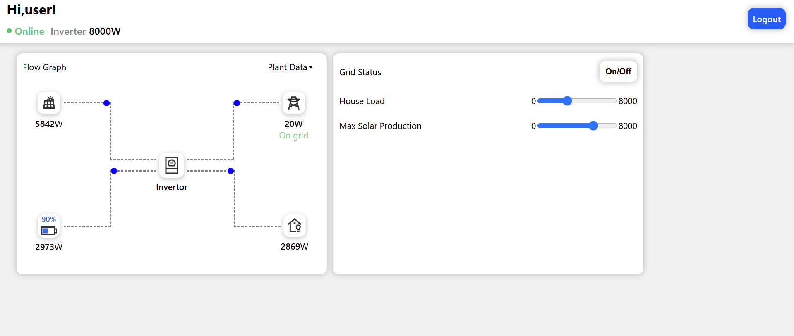

# ☀️ Solar Simulation System(still in development)

A web-based Solar Simulation System that models and visualizes solar energy performance using an interactive frontend built with **HTML**, **CSS**, and **JavaScript**, powered by a **Django** backend written in **Python**.

[Live demo click here](https://solar-system-simulator-8voo.onrender.com/register)

---

## 🚀 Features

- **Real-time solar simulation** if there are multiple devices logged in with the same username the changes that the user makes on his device updates across all devices in real time.
- **Energy calculations** — compute estimated solar energy output.
- **Database integration** — stores user simulations using SQLite.
- **Admin panel** — manage data and configurations with Django Admin.
- **Responsive UI** — designed with clean, mobile-friendly HTML and CSS.

---

## 🧠 Tech Stack

| Layer               | Technology            |
| ------------------- | --------------------- |
| **Frontend**        | HTML, CSS, JavaScript |
| **Backend**         | Django (Python)       |
| **Database**        | SQLite (default)      |
| **Version Control** | Git & GitHub          |
| **Environment**     | Virtualenv / venv     |

---

  

